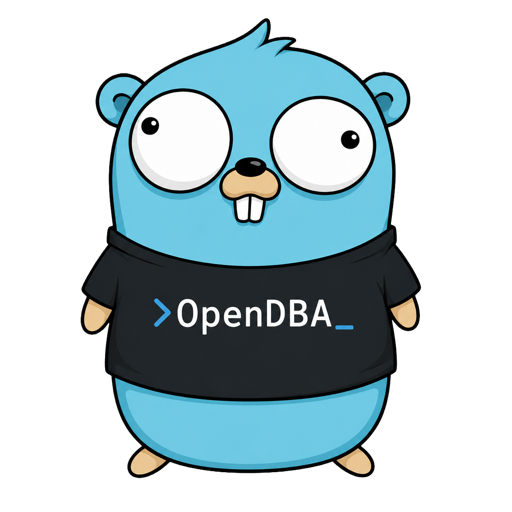
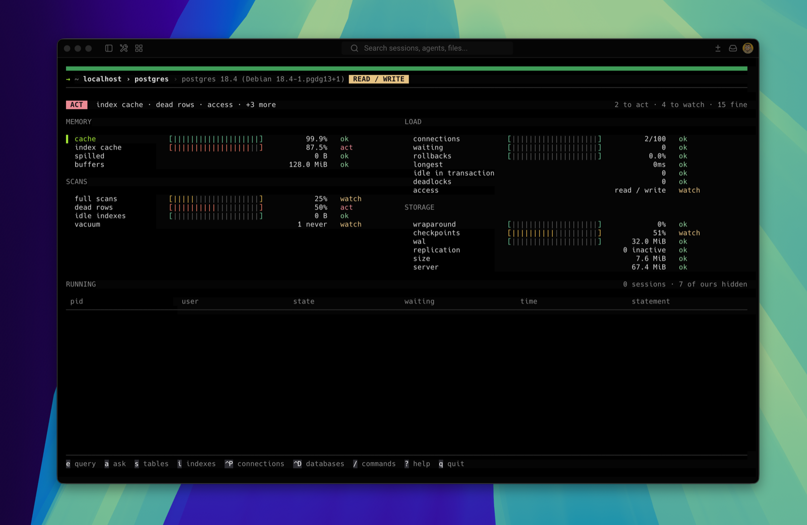
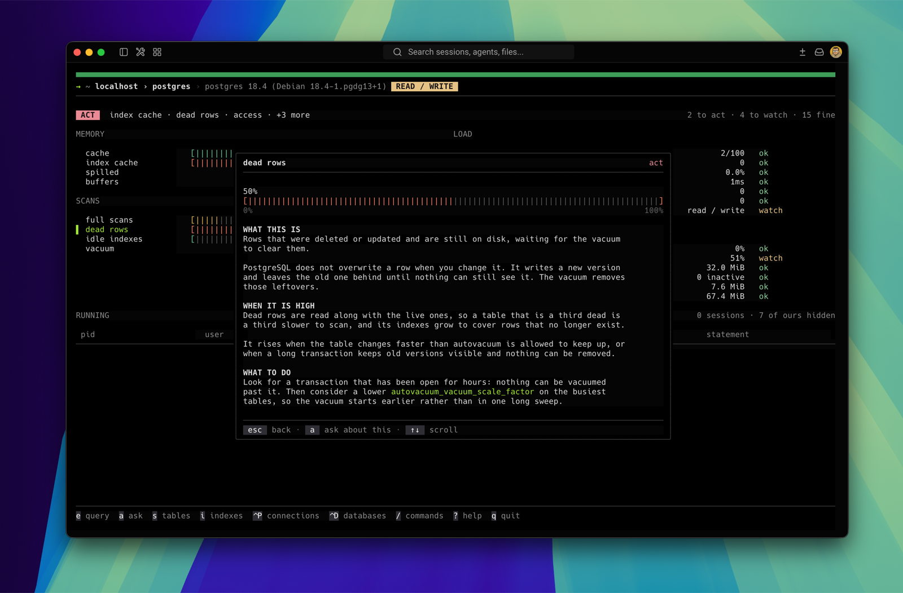
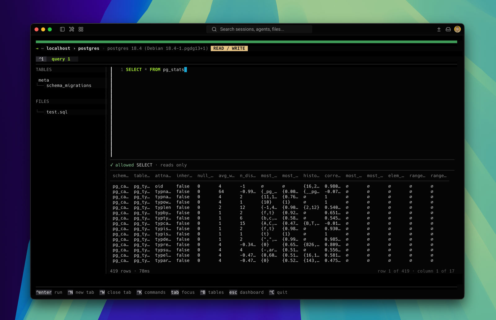
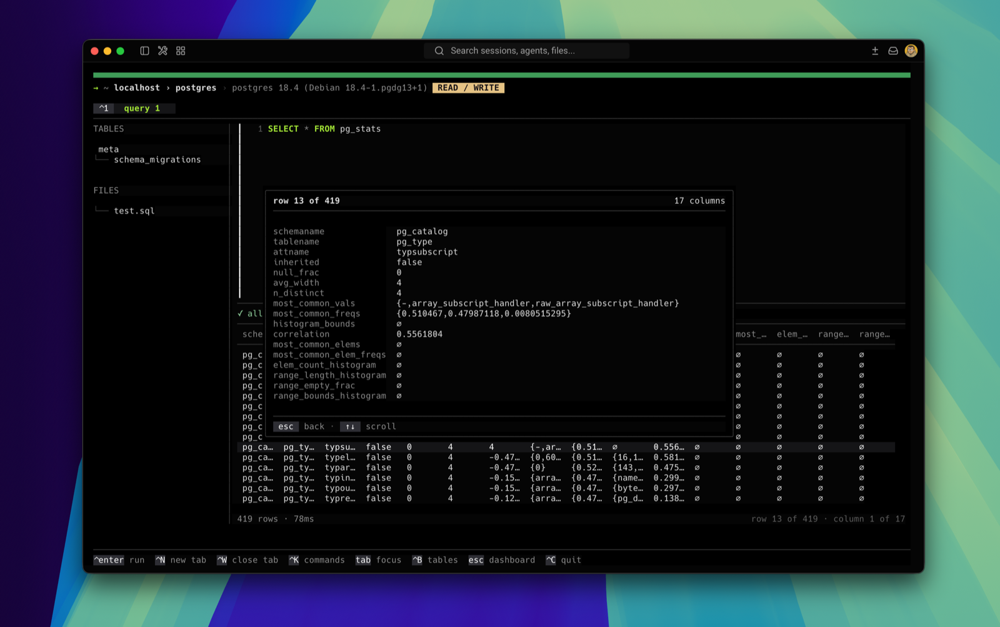
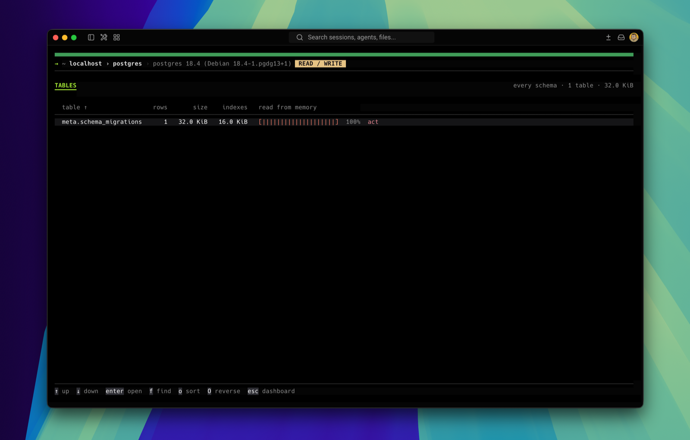
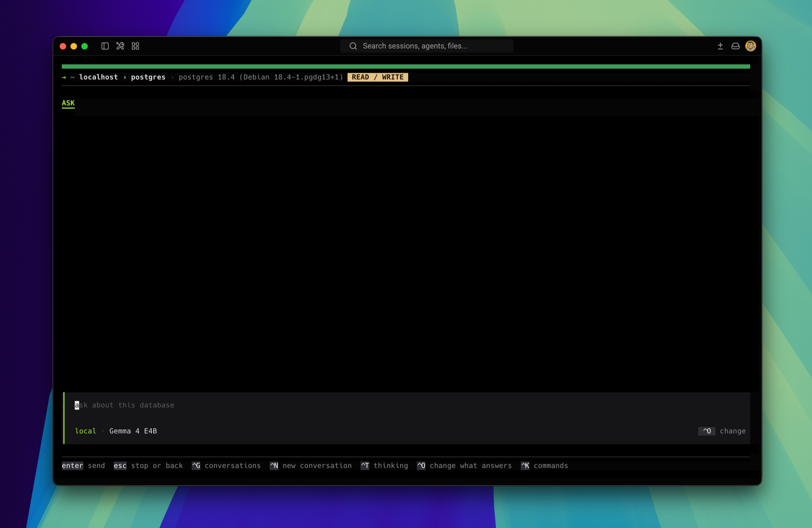

<p align="center">
  
</p>

<h1 align="center">OpenDBA</h1>

<p align="center">
  <b>A terminal workbench for PostgreSQL, SQL Server and SQLite.</b><br>
  <i>Know where you are. Know what you are running.</i>
</p>

<p align="center">
  <a href="https://github.com/sonquer/opendba/actions/workflows/ci.yml"></a>
  <a href="https://github.com/sonquer/opendba/actions/workflows/nightly.yml"></a>
  <a href="https://github.com/sonquer/opendba/blob/main/src/cli/go.mod"></a>
  
  <a href="#licence"></a>
  
</p>

<p align="center">
  
</p>

OpenDBA connects to a database and shows you what it is doing: the health of the
server, what is running on it right now, what it holds, and an editor to ask it
questions. Every statement is parsed against the real grammar of the target
database before it is sent, and on a read-only profile anything that would change
data is refused rather than warned about.

It is in development.

## Install

Every release publishes an archive for Linux, macOS and Windows, on both amd64
and arm64, with build provenance and a signed checksum file. Pick one from the
[latest release](https://github.com/sonquer/opendba/releases/latest), unpack it,
and put `opendba` on your `PATH`.

```bash
go install github.com/sonquer/opendba/src/cli/cmd/opendba@latest
```

`go install` resolves the `src/cli/vX.Y.Z` tag, which every release pushes
alongside the plain one, because the product is a nested module.

Nothing else is needed at run time. There is no cgo, no libpq, and no SQLite to
install: everything the program talks to a database with is compiled into it,
including the inference library that runs a local model. That is what makes the
binary large.

### Nightly builds

[The `nightly` release](https://github.com/sonquer/opendba/releases/tag/nightly)
is `main` as it stood last night, built for the same six targets and replaced
every night. Its version reads `X.Y.Z-nightly.<date>.<commit>`, so it sorts
after the release it was cut from. It is not supported and carries no
compatibility promise.

### Verifying what you downloaded

Every archive, every SBOM and `checksums.txt` carry build provenance, and
`checksums.txt` is signed with a keyless cosign signature tied to the workflow
that built it. Check one before you run it:

```bash
gh attestation verify opendba_0.1.0_linux_amd64.tar.gz --repo sonquer/opendba
```

## Quick start

```bash
opendba
```

The first run has no connection to open, so it asks for one: a driver, the
details, an access mode, and a colour for the environment. The connection is
tested before it is saved, and the password goes to your keychain rather than
into the profile.

After that: `e` for the editor, `a` to ask, `s` for the tables, `?` for the keys,
`/` for everything else.

## The dashboard

The bar across the top is the connection: where you are, what version answered,
and whether this profile may write. Its colour is yours to set per connection, so
production does not look like staging.

Under it are the readings, grouped by what they are about, each with a bar, a
value and a verdict of `ok`, `watch` or `act`. The headline names the subsystems
that need attention and counts the rest. A driver that cannot measure something
says so rather than reporting a zero.

What is measured depends on the engine: PostgreSQL reports cache and index hit
ratios, spilled temp files, connections, waiting locks, deadlocks, long-running
and idle-in-transaction sessions, sequential scans, dead rows, unused indexes,
vacuum age, transaction wraparound, forced checkpoints, WAL and replication
slots. SQL Server reports page life expectancy, pending memory grants, the top
wait, log space and reuse waits, missing indexes, statistics age and the last
backup. SQLite reports an integrity check, the journal mode, free pages and the
foreign key check.

Below that is what is running on the server right now, refreshed every three
seconds, with `c` to cancel a statement and `x` to close a session. The
connections OpenDBA itself made are hidden unless you ask for them.

### What a reading means

<p align="center">
  
</p>

`enter` on a reading opens the number with the reasoning behind it: what it is,
what it means when it is high, and what to do about it. There is one of these
written for every reading of every engine.

`a` on that page carries the reading into a conversation, so the next question
already knows which number you are looking at.

## The editor

<p align="center">
  
</p>

Tabs, each with its own statement, its own result and its own split. The schema
of the current database is beside the editor, and under it the `.sql` files kept
for this connection. `enter` on a table opens its rows in a tab of its own with
the statement that read them written into it; `enter` on a file opens the file.

The statement is coloured as you type it, and what could finish the word is drawn
after the cursor in grey — tables, the columns of the tables the statement
already names, and keywords. `tab` takes it.

The line under the editor is the classifier's verdict on what the cursor is in,
before anything is sent: in the screenshot, `✓ allowed SELECT · reads only`. A
buffer holding several statements separated by semicolons is a script, and what
runs is the one the cursor is in.

A statement keeps running when you leave the editor. The tab is marked, the
header says how much is still out from wherever you are, and `f7` gives up on it.

`f6` asks the server what it would do with the statement instead of doing it, and
draws the plan as a tree; `enter` there escalates to `EXPLAIN ANALYZE` after
asking. `ctrl+e` writes the whole result — not the rows on screen — to CSV, JSON,
XLSX, Markdown or XML. `ctrl+g` opens what you have run, searchable, with `space`
to keep one.

### A row on its own page

<p align="center">
  
</p>

`enter` on a row, or a click, opens it as a page of names and values, because a
row wider than the screen is a row you want to read first. `y` copies the value
under the cursor and `Y` the whole row, over OSC 52, which tmux ignores unless
`set -g set-clipboard on`.

## Tables and indexes

<p align="center">
  
</p>

`s` lists the tables of the schemas you have selected — rows, size, index size,
and how much of the table is read from memory rather than disk. `i` does the same
for indexes: which table, how big, how often read. `f` filters, `o` sorts, `O`
reverses, and `enter` opens one.

`ctrl+d` chooses which database and which schemas those screens cover. What you
choose is written back to the profile, so the next run starts where you left off.

## The assistant

<p align="center">
  
</p>

`a` opens a conversation about the database in front of you. It is not a
statement generator: it reads the schema, the relations, the indexes and the
health readings with tools, and answers from what it read.

Every statement it wants to run meets the same classifier yours does, in the same
access mode, and is shown to you before it runs. It cannot write in any mode.

What answers is up to you. `ctrl+o` opens the list: models that run on this
machine, and providers that need a key — Anthropic, OpenAI, Gemini, Ollama, or
any OpenAI-compatible endpoint you name. If `ANTHROPIC_API_KEY`, `OPENAI_API_KEY`
or `GEMINI_API_KEY` is already set, that provider is offered with a reference to
the variable; the value is never copied into the configuration.

Choosing a local model downloads it and runs it in this process through
llama.cpp, with no network and no cgo. The catalogue holds Gemma 4 E2B, E4B and
12B, and GPT-OSS 20B and 120B, each Apache-2.0 or MIT, each pinned to a commit,
each listed with what it will actually cost you in memory. A model is read into
memory when you ask your first question, not when you open the screen.

Before anything goes to a machine that is not this one, the screen says what
would be sent and waits for you. A model running here sends nothing anywhere.

## From the shell

The interface is the default, not the whole program. Every screen has a command
behind it, and `--json` on any of them prints a machine-readable report against a
versioned schema.

```bash
opendba                                   # the interface
opendba inspect                           # the health of the connected database
opendba inspect --json                    # the same, for something else to read
opendba schema  --schema public           # the tables of one schema
opendba indexes --connection staging      # the indexes, on another connection
opendba query 'select count(*) from orders'
opendba connections                       # what is configured
opendba version
```

| flag | does |
|---|---|
| `--json` | print a machine-readable report |
| `--connection <name>` | which connection to use, the first configured one by default |
| `--schema <name>` | limit the report to one schema |
| `--limit <rows>` | how many rows to read |
| `--yes` | send a statement that changes data without being asked |

`inspect` exits non-zero when the database is not healthy, and a statement the
classifier refuses exits `3`, so both are usable from a script or a check.

## Safety

Four layers, and a statement has to pass all of them:

0. the client-side classifier — the statement is parsed against the real grammar
   of the target database and classified before it is sent,
1. the database role — documented, user-owned, and the only real boundary,
2. session pinning — `default_transaction_read_only`, statement and lock timeouts,
3. a read-only transaction around every read.

A READ ONLY profile can send nothing that changes data. A READ / WRITE profile
asks before it sends one, and keeps what it ran: the transaction is committed
unless the statement failed or you gave up on it.

The classifier is not a search for keywords. It catches a `DELETE` hidden in a
CTE, a `SELECT ... INTO`, a `SELECT ... FOR UPDATE`, an `EXPLAIN ANALYZE` of a
write, and a call to a function that changes the server while parsing as a read —
`pg_terminate_backend`, `setval`, `lo_import`, `dblink_exec` and their like — but
not a column that merely happens to be named after one. Statements OpenDBA never
runs at all, such as `COPY`, `SET`, `BEGIN`, `VACUUM` or `REINDEX`, are refused
in both modes, and so is one PostgreSQL will not run inside a transaction block,
such as `DROP DATABASE` or `CREATE INDEX CONCURRENTLY` — refused by the
classifier rather than sent and rejected by the server.

Multi-statement input is refused in every access mode. A password is never
written to `profiles.toml`, to `--json`, to the query history, or to any screen:
the profile holds a reference to the keychain, an age-encrypted vault, an
environment variable, a command, `~/.pgpass`, or a prompt. An API key in
`settings.toml` is the same — a literal key there is a configuration error, not a
convenience.

[SECURITY.md](SECURITY.md) is what to do if you find a hole in that.

## Configuration

```text
$XDG_CONFIG_HOME/opendba/     (or ~/.config/opendba/)
  profiles.toml    0600  connection metadata, never a password
  settings.toml    0600  theme, safety defaults, workspace, assistants
  secrets.age      0600  only when the encrypted vault is used

$XDG_DATA_HOME/opendba/       (or ~/.local/share/opendba/)
  sql/<connection>/      the .sql files the sidebar lists
  models/                weights, and a manifest saying what they are

$XDG_STATE_HOME/opendba/      (or ~/.local/state/opendba/)
  history.db             statements you have run
  chats.db               conversations with the assistant
  engine.log             what llama.cpp said this run
  crash-<when>.log       an account of a failure that ended the program
```

Both `.toml` files are refused if another user can read them, and the directory
is forced to `0700`. None of that is enforced on Windows.

Everything in `settings.toml` except the assistant is on the settings screen; the
assistant has a screen of its own. Two settings are worth knowing about from the
outside, because they depend on your font and your terminal rather than on your
taste:

```toml
[appearance]
  bar   = "pipes"   # pipes smooth shade rail segments braille ascii
  mouse = "on"      # off gives the terminal its mouse back, for selecting text
```

To see the bars in your own font before choosing:

```bash
go run ./src/cli/cmd/screens
```

## Keys

`/` opens the command list, which reaches every screen without knowing a single
shortcut. On a screen where you type, a slash is a slash, so `ctrl+k` does it
there. `?` prints the rest of this table inside the program.

| key | does |
|---|---|
| `e` `a` `s` `i` | editor, ask, tables, indexes |
| `ctrl+enter` `ctrl+r` `f5` | run the statement |
| `f7` | give up on the statement this tab is waiting for |
| `f6` | what the server would do with the statement |
| `ctrl+s` | save the tab to a file |
| `ctrl+e` | write the result to a file |
| `ctrl+n` `ctrl+w` | open a tab, close it |
| `ctrl+1`…`ctrl+9` | go to a tab by its place |
| `ctrl+b` | show or hide the schema beside the editor |
| `ctrl+p` | connections: where you are working, and what else you could open |
| `ctrl+d` | the databases and schemas of the connection you are on |
| `ctrl+g` | what you have run, or what you have asked |
| `ctrl+o` `ctrl+t` | change what answers, show its working |
| `z` | zoom a result to the whole window |
| `y` `Y` | copy the value, copy the row |
| `tab` | move between the panes |
| `esc` | go back, leaving what is running to run |
| `q` | quit, then `enter` to confirm |

Terminals that speak the Kitty keyboard protocol (Ghostty, kitty, WezTerm) also
send `ctrl+tab` and `ctrl+shift+tab` for the neighbouring tab, and the footer
names `ctrl+enter` for run once the terminal has said it can tell it apart. On
macOS the modifiers are drawn the way the keyboard prints them.

## What is not there yet

- **MySQL and MariaDB** are planned behind the same driver interface.
  PostgreSQL, SQL Server and SQLite exist.
- **SQL Server has one fewer safety layer than PostgreSQL.** There is no session
  setting that makes a connection read only and no statement timeout the server
  enforces, so a read only profile there rests on the client-side classifier and
  on the permissions of the login, and a statement deadline is the client's
  alone. Connect as a login that cannot write.
- **`theme` and `accent`** are read out of `settings.toml` and round-tripped, but
  nothing is drawn from them yet. The colour that does have an effect is the one
  set per connection.

Not planned: a web interface, migrations, backup and restore, or anything that
writes to your database without you typing it first.

## Contributing

[CONTRIBUTING.md](CONTRIBUTING.md) is how to build and test it,
[ARCHITECTURE.md](ARCHITECTURE.md) is how it is put together, and
[AGENTS.md](AGENTS.md) is the rules the code is held to.

```bash
go run ./src/tools/cmd/dev check --ci
```

One thing that surprises people reading the tree: the llama.cpp shared libraries
under `src/cli/internal/ai/providers/local/embedded/` are committed on purpose.
They are what lets a local model run with nothing fetched at run time. It costs
the project the OpenSSF `Binary-Artifacts` check, which is a trade made
knowingly rather than an oversight.

## Contributors

<a href="https://github.com/sonquer/opendba/graphs/contributors">
  
</a>

[CONTRIBUTING.md](CONTRIBUTING.md) is how to join them.

## Built with

[Bubble Tea, Bubbles, Lip Gloss and Glamour](https://charm.land) for the
interface, [pgx](https://github.com/jackc/pgx) for PostgreSQL,
[go-mssqldb](https://github.com/microsoft/go-mssqldb) for SQL Server,
[modernc.org/sqlite](https://pkg.go.dev/modernc.org/sqlite) for SQLite with no
cgo, [ANTLR](https://www.antlr.org) for the grammars,
[llama.cpp](https://github.com/ggml-org/llama.cpp) through
[purego](https://github.com/ebitengine/purego) for local models, and
[go-keyring](https://github.com/zalando/go-keyring) and
[age](https://github.com/FiloSottile/age) for the secrets.

## Licence

MIT or Apache 2.0, at your option.
